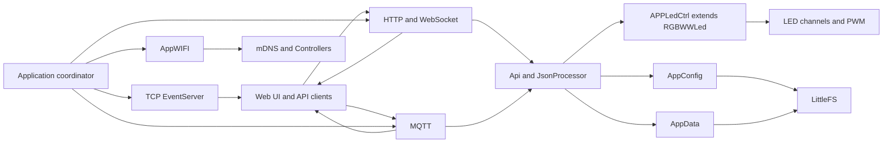

# Firmware Architecture

This document maps the firmware's main components, how requests and state move
between them, and the order in which the application is brought up. It focuses
on the runtime architecture; build and flashing instructions remain in the
[README](README.md).

## System Map

The firmware is a Sming application. `Application` is its composition root: it
owns the service objects and coordinates startup, shutdown, shared configuration
and cross-service events.

The principal responsibilities are:

| Component | Responsibility | Relationship to other components |
|---|---|---|
| `Application` | Owns application-wide services and sequences initialization, timers, and shutdown. | Connects configuration, networking, LED control, APIs, and event producers. |
| `AppConfig` / `AppData` | Generated ConfigDB models for device configuration and persistent user/application data. | Stored in LittleFS; accessed through scoped ConfigDB objects by the owning service. |
| `AppWIFI` | Configures station and first-run access-point behavior and handles Wi-Fi lifecycle callbacks. | Starts network-dependent services after connection; starts mDNS once an IP is assigned. |
| `ApplicationWebserver` | Serves the web application and HTTP API; owns the WebSocket endpoint. | Routes HTTP commands and JSON-RPC requests to `Api`; broadcasts live events. |
| `Api` / `JsonProcessor` | Implements data queries, command dispatch, and command validation. | Uses ConfigDB-backed JSON schemas and forwards control requests to `APPLedCtrl`. |
| `RpcCodec` | Renders API, event, and command payloads using generated ConfigDB types. | Shared by HTTP/WebSocket, MQTT, and TCP event publishing paths. |
| `APPLedCtrl` / `RGBWWLed` | Application-specific LED controller extending the RGBWW library's color conversion, per-channel output, and animation/transition engine. | Applies commands, drives PWM outputs, and publishes state changes and transition completion. |
| `AppMqttClient` | Publishes state/events and receives configured MQTT command topics. | Uses the shared command path for device commands and publishes through `RpcCodec`. |
| `EventServer` | Sends state-change events to persistent TCP clients. | Receives event publications from application and LED-control callbacks. |
| `Controllers` / `mdnsHandler` | Tracks known controllers and advertises/discovers network services. | Uses mDNS and `AppData`; supports peer awareness and controller synchronization. |
| `ApplicationOTA` / `WebappOta` | Manages firmware-image updates and web-application asset updates respectively. | Firmware OTA works with the boot/partition layer; webapp OTA stages files on LittleFS. |
| `TelemetryClient` / `UdpSyslogStream` | Sends periodic telemetry and diagnostic logs. | Uses network connectivity and configuration; syslog is enabled in applicable builds. |

## Request and State Flow

1. HTTP requests enter `ApplicationWebserver`. JSON-RPC requests arrive through
   its WebSocket handler. Both route device commands through `Api` and
   `JsonProcessor`.
2. MQTT command messages are decoded by `AppMqttClient` and forwarded through
   the same command-dispatch layer where applicable.
3. `APPLedCtrl`, built on `RGBWWLed`, applies the operation, updates PWM
   outputs, and advances the animation queues.
4. State changes are made available to clients over WebSocket, MQTT, or the TCP
   event server according to configuration. `transition_finished` is emitted
   when an animation step completes.
5. Persistent configuration and application data are separate ConfigDB stores
   backed by LittleFS. The transient JSON-RPC store is used to import or render
   one message at a time and is not application persistence.

The API schemas live in the `.cfgdb` files. Generated types and `RpcCodec`
provide the JSON boundary, while command semantics and cross-field validation
remain in the API/processor layer.

## Bring-Up Sequence

The main sequence is implemented by `init()`, `onReady()`,
`Application::init()`, `Application::startServices()`, and the Wi-Fi callbacks.

1. Sming enters the firmware's `init()` function, initializes serial logging,
   and calls `onReady()`.
2. `onReady()` checks crash-loop state and calls `Application::init()`.
3. `Application::init()` checks the active boot/OTA partition, mounts the
   active filesystem, performs required boot-time OTA checks, and opens the
   ConfigDB configuration and data stores. Legacy webapp settings are migrated
   to their own store when present.
4. Configuration is checked, the controller registry is prepared, hardware
   pin configuration is selected, and `APPLedCtrl` initializes the LED/control
   engine. Buttons, HTTP routes, and Wi-Fi callbacks are then initialized.
5. `Application::startServices()` starts the RGBWW engine, enables the TCP
   event server when configured, and schedules the HTTP server startup after a
   short delay.
6. If no Wi-Fi credentials are configured, `AppWIFI` starts the setup access
   point. Otherwise it connects in station mode. On connection, network services
   such as MQTT (when enabled) and telemetry are started.
7. Once the station receives an IP address, the firmware starts mDNS and
   updates the local controller registry. A delayed webapp update check is also
   scheduled.

The access point is a recovery/setup path, not a prerequisite for normal
station-mode operation. Services that require a broker or reachable network
are conditional on their configuration and on network availability.

## Storage and Update Boundaries

- **Firmware image:** boot/partition management selects the running firmware
  and supports firmware OTA and rollback behavior.
- **Configuration:** `AppConfig` stores network, hardware, security, and runtime
  settings in the `app-config` ConfigDB area.
- **Application data:** `AppData` stores presets, scenes, groups, and controller
  records in the `app-data` ConfigDB area.
- **Web application:** static assets and staged webapp updates use LittleFS and
  the separate `WebappOta` path. Firmware and webapp update status/endpoints are
  therefore distinct.

For the public endpoint and command contracts, see the [HTTP API](README.md#http-api-reference),
[WebSocket API](README.md#websocket-api), and [MQTT integration](README.md#mqtt-integration)
sections in the README.

## Message Schema Layering

Outbound and inbound API messages are modelled by four ConfigDB schema files
that form a deliberate layered stack. The split exists so a single populated
payload object can be serialized either bare (HTTP) or wrapped in a JSON-RPC
envelope (WebSocket / TCP event server / MQTT) without redefining its shape.

| File | Layer | Role |
|---|---|---|
| [value-types.cfgdb](value-types.cfgdb) | scalars | Reusable constrained primitives (`string-value`, `raw-value`, `hue-value`, `error-code`, …). |
| [homeassistant.cfgdb](homeassistant.cfgdb) | Home Assistant | Home Assistant MQTT command, state, discovery, and info payload schemas. |
| [params.cfgdb](params.cfgdb) | payload | Transport-independent body objects. This is exactly what the HTTP interface sends and receives, and also what becomes the JSON-RPC `params`/`result`. |
| [jsonrpc.cfgdb](jsonrpc.cfgdb) | framing | A root `oneOf` of message bodies. The ConfigDB library emits the `{"jsonrpc":"2.0",…}` envelope and selects the `params`/`result`/`error` key from `Message::kind`; each member references the body shape it frames. |

### Two serialization entry points, one payload

- **HTTP** renders a [params.cfgdb](params.cfgdb) body object directly (bare,
  unframed).
- **WS / TCP / MQTT** render the same body wrapped by the
  [jsonrpc.cfgdb](jsonrpc.cfgdb) envelope.

`RpcCodec` (see the component table above) owns both paths so one producer
populates one payload object and either transport can render it.

### Authoring rule

Define a reusable transport-independent body once in [params.cfgdb](params.cfgdb)
`$defs` and reference it. Keep Home Assistant-specific MQTT schemas in
[homeassistant.cfgdb](homeassistant.cfgdb). Add a [jsonrpc.cfgdb](jsonrpc.cfgdb)
root member only when a body is actually sent over a framed transport; HTTP-only
bodies need no framing entry. Primitive constraints belong in
[value-types.cfgdb](value-types.cfgdb), never inlined.

Design and migration history for this stack lives in
[CONFIGDB_JSONRPC_MESSAGES_PLAN.md](CONFIGDB_JSONRPC_MESSAGES_PLAN.md),
[CONFIGDB_JSON_MIGRATION_PLAN.md](CONFIGDB_JSON_MIGRATION_PLAN.md) and
[CONFIGDB_JSON_INBOUND_PLAN.md](CONFIGDB_JSON_INBOUND_PLAN.md).

### Known deviations (cleanup backlog)

The current files violate the authoring rule in two ways; both are tracked here
so the layering intent stays legible until they are reconciled:

- **Bodies inlined in `jsonrpc.cfgdb` instead of referencing `params.cfgdb`.**
  The framing members `wifi_status`, `transition_finished`, `clock_slave_status`,
  `keep_alive`, `message_event`, `ota_status`, `webapp_ota_status`,
  `api_success`, `api_error`, `authenticate_result`, `subscription_result`,
  `rpc_error` and `error` define their object bodies inline rather than via
  `$ref` into [params.cfgdb](params.cfgdb).
- **Orphaned payload `$defs`.** [params.cfgdb](params.cfgdb) already carries
   `wifi-status-params`, `transition-finished-params`, `clock-slave-status-params`
   and `keep-alive-params`, which duplicate (or should back) those inline bodies
   but are currently referenced nowhere. [homeassistant.cfgdb](homeassistant.cfgdb)
   also carries the currently unused `ha-discovery-params` definition.
- **Conflicting `error` shapes.** [params.cfgdb](params.cfgdb) `error` is
  `{code, message, data}`; the [jsonrpc.cfgdb](jsonrpc.cfgdb) inline `error`
  wraps `{error: value-types/error-msg}`; and the inline `rpc_error` adds a
  `challenge` field. These need a single deliberate error body before they can
  be consolidated.

Reconciliation means moving each inline body into [params.cfgdb](params.cfgdb)
`$defs` (reusing the orphaned definitions where they already match) and reducing
the [jsonrpc.cfgdb](jsonrpc.cfgdb) members to `$ref`s.
